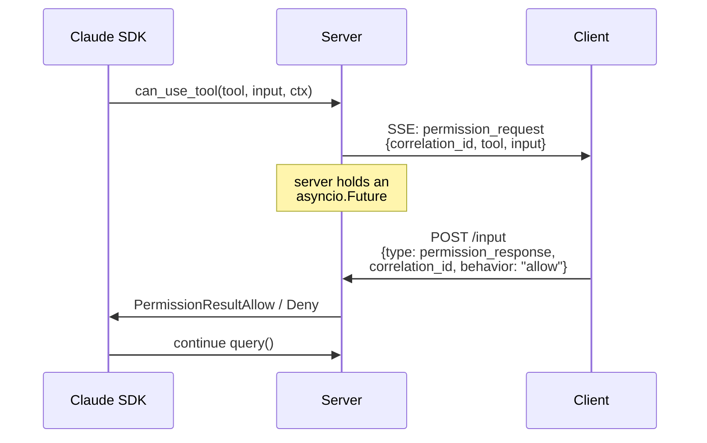

agent-webkit is small, but the wire protocol has a few load-bearing ideas. This page walks through them at the level of "what's actually happening on the wire" — useful before reading any of the guides.

## Sessions are long-lived

Each call to `createAgentClient(...)` (or `useAgentSession()`) hits `POST /sessions`, which spawns a Claude Agent SDK `ClaudeSDKClient`. That client owns a Claude Code CLI subprocess. **One client per session, not per request** — `connect()` is expensive, and re-paying that cost on every turn would be brutal.

A session lives until:

1. The client calls `DELETE /sessions/{id}`, or
2. The server idle-evicts it (default: 5 minutes since last input or subscriber).

While alive, the session has:

- A single inbound queue (user messages, interrupts, permission/question replies).
- One in-flight `ClaudeSDKClient.query()` at a time.
- A bounded ring buffer of past SSE events for resume (default: 1000).
- Zero or more subscribers tailing the stream.

## Two ID schemes coexist

This trips people up so it's worth being explicit:

| ID                          | Source       | Used for                                       |
| --------------------------- | ------------ | ---------------------------------------------- |
| **`id`** (top-level SSE id) | server       | `Last-Event-ID` resume only                    |
| `message_id`                | SDK          | reconciling `message_delta` → `message_complete` |
| `tool_use_id`               | SDK          | matching `tool_use` to `tool_result`           |
| `correlation_id`            | server / SDK | matching `permission_request` to `permission_response` |

The top-level `id` is a server-only monotonic seq — that's what the SSE protocol uses to resume. The other IDs identify *content*, not events; they survive resume and are how the L2 client knows that two events are about the same message.

## Multi-subscriber fan-out

Any number of clients can `GET /sessions/{id}/stream` simultaneously. Each gets its own cursor into the ring buffer. Reasons this matters:

- A user opens the app in two tabs — both should see the same agent stream.
- A reconnect after Wi-Fi blip is just a *new* subscriber with `Last-Event-ID: <last_seq>`.
- A debug tool can attach without disturbing the user's session.

Fan-out is independent at the cursor level — one slow subscriber can't backpressure another.

## Permission RPC, on the wire

When the SDK calls `can_use_tool(...)` mid-`query()`:



If two subscribers race to reply (multi-tab), **first reply wins**. The loser's POST gets `409 Conflict`. The L2 React hook surfaces this as a state machine: `requested` → `responding` → `resolved | conflict`.

## AskUserQuestion as a first-class event

`AskUserQuestion` is an SDK tool, so it *technically* arrives as a `tool_use` block. But it's the only tool whose semantics are "stop and ask the user something". Forcing every UI to special-case a particular tool name would be ugly. So agent-webkit pulls it up to its own event:

```
SSE: ask_user_question { correlation_id, questions }
POST /input { type: question_response, correlation_id, answers }
```

Same race semantics as permissions.

## Resume after disconnect

The SSE stream is a pure derived view of the session's event log. The server holds the last `N` events (default 1000) in a ring buffer. When a client reconnects:

```
GET /sessions/{id}/stream
Last-Event-ID: 247
```

…the server replays everything with `seq > 247`, then transitions to live tailing. If `247` has been evicted from the ring buffer (the buffer is full and has rolled past), the server returns `412 Precondition Failed` — the client must reset its view.

Sizing the ring buffer is a tradeoff: bigger buffers tolerate longer disconnects but use more memory. See [Resume & reconnect](/docs/guides/resume-and-reconnect).

## Interrupts don't drain

`POST /input { type: "interrupt" }` calls `client.interrupt()`. Important: this does **not** drain the SDK's receive loop. The server must finish draining `receive_messages()` before the next `query()` starts. The L2 hook handles this for you — interrupts go into a `cancelling` state and resolve to `idle` once the trailing events arrive.

## Where to read next

- [Wire protocol reference](/docs/reference/wire-protocol) — the full event/message catalog.
- [Architecture](/docs/architecture) — *why* it's shaped this way.
- [Permissions guide](/docs/guides/permissions) — production patterns for the permission UI.
